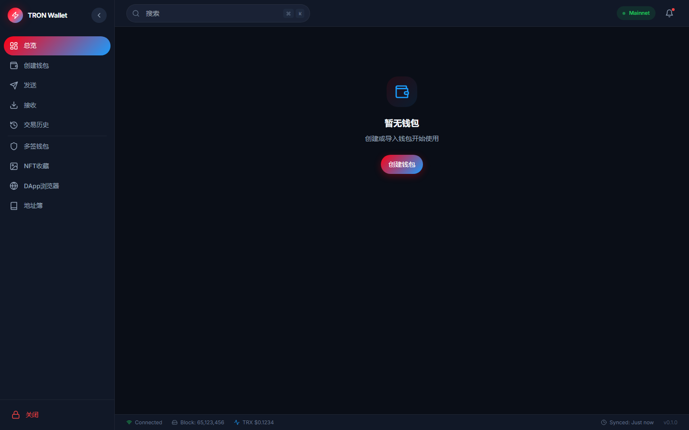

<div align="center">

# TRON Wallet

**A modern, secure, cross-platform desktop wallet for the TRON blockchain.**

Built with Tauri 2 + React 18 + Rust for maximum security and performance.

[](LICENSE)
[](https://tauri.app)
[](https://react.dev)
[](https://www.rust-lang.org)
[](https://www.typescriptlang.org)

<br/>



</div>

---

## Features

### Core Wallet
- **Create & Import Wallets** — Single-sig wallets via mnemonic phrase or private key
- **Watch-Only Wallets** — Monitor any TRON address without storing keys
- **Multi-Sig Wallets** — Import and manage on-chain multi-signature accounts
- **HD Wallet Derivation** — BIP44-compatible key derivation (secp256k1)
- **AES-256-GCM Encryption** — Private keys encrypted with user password

### Transactions
- **Send TRX** — Native TRX transfers with real-time signing
- **Send TRC-20 Tokens** — USDT, USDC, JST, WIN, BTT and any TRC-20 token
- **Transaction History** — Full transaction history with infinite scroll pagination
- **Fee Estimation** — Real-time bandwidth/energy cost calculation
- **QR Code** — Generate receive addresses as QR codes

### Resource Management
- **Bandwidth & Energy** — Real-time resource usage monitoring
- **Stake TRX (Freeze)** — Freeze TRX for bandwidth or energy (Stake 2.0)
- **Unstake (Unfreeze)** — Unfreeze with 14-day countdown display
- **Delegate Resources** — Delegate bandwidth/energy to other accounts
- **Withdraw Expired** — Claim expired unfrozen TRX

### Voting & Governance
- **Super Representatives** — Browse all 27 SRs with stats
- **Vote Allocation** — Distribute votes across multiple SRs
- **Voting Power** — Based on staked TRX (1 TRX = 1 Vote)

### Additional Features
- **DApp Browser** — Quick access to SunSwap, JustLend, APENFT, TRONSCAN
- **Address Book** — Save, organize, and favorite frequently used addresses
- **Auto-Lock** — Configurable inactivity lock (1/5/15/30 min)
- **Multi-Language** — 简体中文, 繁體中文, English
- **Dark Mode** — System-aware theme with dark/light toggle
- **Real-Time Price** — TRX price with 24h change, auto-refresh every 60s

---

## Tech Stack

| Layer | Technology |
|-------|------------|
| **Desktop Runtime** | [Tauri 2](https://tauri.app) |
| **Backend** | Rust (tokio, reqwest, aes-gcm, ed25519-dalek, k256) |
| **Frontend** | React 18 + TypeScript 5 |
| **Styling** | Tailwind CSS 3.4 |
| **State Management** | Zustand |
| **Animations** | Framer Motion |
| **Icons** | Lucide React |
| **i18n** | i18next + react-i18next |
| **QR Codes** | qrcode.react |
| **Charts** | Recharts |
| **Build** | Vite 5 |
| **Testing** | Vitest + Playwright |

---

## Getting Started

### Prerequisites

- [Node.js](https://nodejs.org) >= 18
- [pnpm](https://pnpm.io) (recommended) or npm
- [Rust](https://www.rust-lang.org/tools/install) >= 1.75
- Platform-specific dependencies for Tauri — see [Tauri Prerequisites](https://v2.tauri.app/start/prerequisites/)

### Installation

```bash
# Clone the repository
git clone https://github.com/kongbaisos/tron-wallet.git
cd tron-wallet

# Install dependencies
pnpm install
```

### Development

```bash
# Start the dev server (frontend + backend)
pnpm tauri dev
```

This launches the Vite dev server with hot reload and the Tauri backend in debug mode.

### Build

```bash
# Build for production
pnpm tauri build
```

The compiled binary will be in `src-tauri/target/release/` and the installer in `src-tauri/target/release/bundle/`.

---

## Project Structure

```
tron-wallet/
├── src/                          # Frontend (React + TypeScript)
│   ├── components/
│   │   ├── layout/               # App shell (Header, Sidebar, StatusBar)
│   │   └── ui/                   # Reusable components (Button, Input, Modal, etc.)
│   ├── pages/                    # Route pages
│   │   ├── Dashboard.tsx         # Portfolio overview + token list
│   │   ├── Wallet.tsx            # Wallet management (create/import/delete)
│   │   ├── Send.tsx              # Send TRX / TRC-20
│   │   ├── Receive.tsx           # Receive with QR code
│   │   ├── History.tsx           # Transaction history with filters
│   │   ├── Resource.tsx          # Bandwidth/Energy staking
│   │   ├── Voting.tsx            # SR voting
│   │   ├── Multisig.tsx          # Multi-signature management
│   │   ├── NFT.tsx               # NFT gallery
│   │   ├── DApp.tsx              # DApp browser
│   │   ├── AddressBook.tsx       # Address book CRUD
│   │   └── Settings.tsx          # App settings
│   ├── stores/                   # Zustand state stores
│   ├── i18n/                     # Translation files (en, zh-CN, zh-TW)
│   ├── hooks/                    # Custom React hooks
│   └── App.tsx                   # Root component
├── src-tauri/                    # Backend (Rust)
│   ├── src/
│   │   ├── commands/             # Tauri command handlers
│   │   ├── core/                 # Core logic (wallet, transaction)
│   │   ├── db/                   # SQLite database (rusqlite)
│   │   ├── models/               # Data models
│   │   ├── network/              # TronGrid API client
│   │   └── crypto/               # Encryption utilities
│   ├── Cargo.toml                # Rust dependencies
│   └── tauri.conf.json           # Tauri configuration
├── public/                       # Static assets
├── package.json                  # Node dependencies
└── tailwind.config.js            # Tailwind configuration
```

---

## Supported Networks

| Network | Endpoint | Status |
|---------|----------|--------|
| **Mainnet** | `api.trongrid.io` | Production |
| **Shasta Testnet** | `api.shasta.trongrid.io` | Testing |

---

## Security

- **Private keys never leave your device** — All signing happens locally
- **AES-256-GCM encryption** — Keys encrypted with user-provided password
- **No telemetry** — Zero data collection or analytics
- **Open source** — Fully auditable codebase
- **Sandboxed backend** — Tauri's security model isolates Rust from the webview

---

## Internationalization

TRON Wallet supports 3 languages out of the box:

| Language | Code | Status |
|----------|------|--------|
| 简体中文 | `zh-CN` | Complete |
| 繁體中文 | `zh-TW` | Complete |
| English | `en` | Complete |

To add a new language, create a translation file in `src/i18n/` and register it in `src/i18n/index.ts`.

---

## Contributors

<table>
  <tr>
    <td align="center">
      <a href="https://github.com/KongBai1145">
        
        <br />
        <sub><b>LouisAlice</b></sub>
      </a>
      <br />
      <span>Creator & Lead Developer</span>
    </td>
  </tr>
</table>

## Contributing

Contributions are welcome! Please follow these steps:

1. Fork the repository
2. Create a feature branch (`git checkout -b feature/amazing-feature`)
3. Commit your changes (`git commit -m 'Add amazing feature'`)
4. Push to the branch (`git push origin feature/amazing-feature`)
5. Open a Pull Request

### Development Guidelines

- **Rust**: Follow `clippy` lints, run `cargo fmt` before committing
- **TypeScript**: Strict mode enabled, no `any` types in new code
- **Commits**: Use conventional commits (`feat:`, `fix:`, `docs:`, etc.)

---

## Roadmap

- [ ] Hardware wallet integration (Ledger)
- [ ] WalletConnect protocol support
- [ ] NFT display with metadata (TRC-721 / TRC-1155)
- [ ] In-app DApp browser with WebView
- [ ] Transaction notifications
- [ ] Address book import/export (CSV)
- [ ] Custom token list management
- [ ] Staking reward analytics

---

## License

This project is licensed under the MIT License — see the [LICENSE](LICENSE) file for details.

---

## Acknowledgments

- [TRON](https://tron.network) — The blockchain infrastructure
- [TronGrid](https://www.trongrid.io) — API for accessing TRON network data
- [Tauri](https://tauri.app) — The desktop application framework
- [Lucide](https://lucide.dev) — Beautiful icon set

---

<div align="center">

**Built with ❤️ for the TRON ecosystem**

</div>
