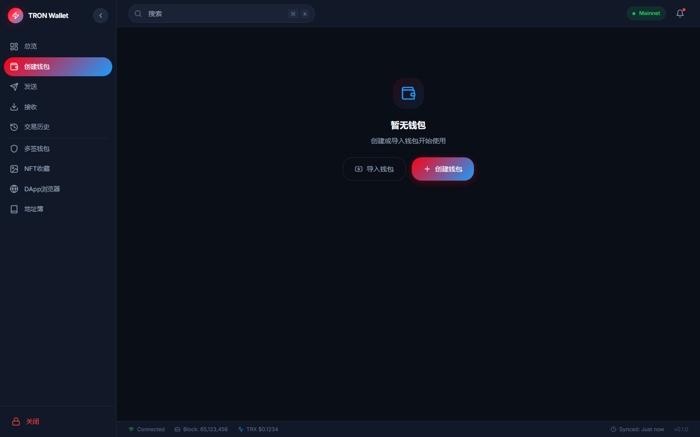

<p align="center">
  
</p>

<h1 align="center">TRON 钱包</h1>

<p align="center">
  <strong>一款现代、安全、跨平台的 TRON 区块链桌面钱包</strong>
</p>

<p align="center">
  <a href="LICENSE"></a>
  <a href="https://tauri.app"></a>
  <a href="https://react.dev"></a>
  <a href="https://www.rust-lang.org"></a>
  <a href="https://www.typescriptlang.org"></a>
</p>

<p align="center">
  <a href="#功能特性">功能特性</a> •
  <a href="#下载安装">下载安装</a> •
  <a href="#快速开始">快速开始</a> •
  <a href="#技术栈">技术栈</a> •
  <a href="#截图预览">截图预览</a>
</p>

<p align="center">
  
</p>

---

## 功能特性

### 核心钱包
- **创建与导入钱包** — 通过助记词或私钥创建单签钱包
- **观察钱包** — 无需存储私钥即可监控任意 TRON 地址
- **多签钱包** — 导入并管理链上多签账户
- **HD 钱包派生** — 兼容 BIP44 标准（secp256k1）
- **AES-256-GCM 加密** — 用户密码加密私钥

### 交易功能
- **发送 TRX** — 原生 TRX 转账，实时签名广播
- **发送 TRC-20 代币** — 支持 USDT、USDC 等任意 TRC-20 代币
- **交易历史** — 完整交易记录，支持筛选与分页加载
- **手续费估算** — 实时计算带宽/能量消耗
- **二维码** — 生成收款地址二维码

### 资源管理
- **带宽与能量** — 实时资源使用情况监控
- **质押 TRX（Freeze）** — 为带宽或能量质押 TRX（Stake 2.0）
- **解冻（Unfreeze）** — 解冻并显示 14 天倒计时
- **资源委托** — 将带宽/能量委托给其他账户
- **提取到期** — 领取已解冻的 TRX

### 投票与治理
- **超级代表** — 浏览全部 27 个 SR 及其数据
- **投票分配** — 将投票分配给多个 SR
- **投票权** — 基于质押的 TRX（1 TRX = 1 票）

### 其他功能
- **DApp 浏览器** — 快速访问 SunSwap、JustLend、APENFT、TRONSCAN
- **地址簿** — 保存、整理、收藏常用地址
- **自动锁定** — 可配置闲置锁定时间（1/5/15/30 分钟）
- **多语言** — 简体中文、繁體中文、English
- **深色模式** — 跟随系统或手动切换
- **实时价格** — TRX 价格与 24h 涨跌，每 60 秒自动刷新

---

## 下载安装

### 最新版本

| 平台 | 下载 | 说明 |
|------|------|------|
| Windows | [tron-wallet_0.1.0_x64-setup.exe](https://github.com/KongBai1145/tron-wallet/releases/latest) | 安装程序 |
| Windows | [tron-wallet_0.1.0_x64_en-US.msi](https://github.com/KongBai1145/tron-wallet/releases/latest) | MSI 安装包 |
| Windows | [tron-wallet_0.1.0_x64.exe](https://github.com/KongBai1145/tron-wallet/releases/latest) | 便携版 |

> 前往 [Releases](https://github.com/KongBai1145/tron-wallet/releases) 页面下载最新版本。

### 系统要求

- **Windows**: Windows 10/11 (x64)
- **macOS**: 即将支持
- **Linux**: 即将支持

---

## 快速开始

### 环境要求

- [Node.js](https://nodejs.org) >= 18
- [pnpm](https://pnpm.io)（推荐）或 npm
- [Rust](https://www.rust-lang.org/tools/install) >= 1.75
- Tauri 平台依赖 — 详见 [Tauri 前置条件](https://v2.tauri.app/start/prerequisites/)

### 安装依赖

```bash
# 克隆仓库
git clone https://github.com/KongBai1145/tron-wallet.git
cd tron-wallet

# 安装依赖
pnpm install
```

### 开发运行

```bash
# 启动开发服务器（前端 + 后端）
pnpm tauri dev
```

### 构建生产版本

```bash
# 构建生产版本
pnpm tauri build
```

构建产物位于 `src-tauri/target/release/bundle/` 目录下。

---

## 技术栈

| 层级 | 技术 |
|------|------|
| **桌面运行时** | [Tauri 2](https://tauri.app) |
| **后端** | Rust（tokio、reqwest、aes-gcm、k256） |
| **前端** | React 18 + TypeScript 5 |
| **样式** | Tailwind CSS 3.4 |
| **状态管理** | Zustand |
| **动画** | Framer Motion |
| **图标** | Lucide React |
| **国际化** | i18next + react-i18next |
| **二维码** | qrcode.react |
| **图表** | Recharts |
| **构建工具** | Vite 5 |

---

## 项目结构

```
tron-wallet/
├── src/                          # 前端（React + TypeScript）
│   ├── components/
│   │   ├── layout/               # 应用外壳（Header、Sidebar、StatusBar）
│   │   └── ui/                   # 通用组件（Button、Input、Modal 等）
│   ├── pages/                    # 页面路由
│   │   ├── Dashboard.tsx         # 资产总览 + 代币列表
│   │   ├── Wallet.tsx            # 钱包管理（创建/导入/删除）
│   │   ├── Send.tsx              # 发送 TRX / TRC-20
│   │   ├── Receive.tsx           # 收款二维码
│   │   ├── History.tsx           # 交易记录（筛选/分页）
│   │   ├── Resource.tsx          # 带宽/能量质押
│   │   ├── Voting.tsx            # 超级代表投票
│   │   ├── Multisig.tsx          # 多签管理
│   │   ├── NFT.tsx               # NFT 画廊
│   │   ├── DApp.tsx              # DApp 浏览器
│   │   ├── AddressBook.tsx       # 地址簿
│   │   └── Settings.tsx          # 设置
│   ├── stores/                   # Zustand 状态管理
│   ├── i18n/                     # 翻译文件（zh-CN、zh-TW、en）
│   └── App.tsx                   # 根组件
├── src-tauri/                    # 后端（Rust）
│   ├── src/
│   │   ├── commands/             # Tauri 命令处理器
│   │   ├── core/                 # 核心逻辑（钱包、交易）
│   │   ├── db/                   # SQLite 数据库
│   │   ├── models/               # 数据模型
│   │   ├── network/              # TronGrid API 客户端
│   │   └── crypto/               # 加密工具
│   ├── Cargo.toml
│   └── tauri.conf.json
├── public/                       # 静态资源
├── package.json
└── tailwind.config.ts
```

---

## 截图预览

<p align="center">
  
  
</p>

---

## 安全说明

- **私钥永不离开设备** — 所有签名均在本地完成
- **AES-256-GCM 加密** — 私钥由用户密码加密保护
- **无遥测** — 零数据收集与分析
- **开源可审计** — 完整开源代码
- **沙盒后端** — Tauri 安全模型隔离 Rust 与 WebView

---

## 支持的网络

| 网络 | 节点地址 | 状态 |
|------|----------|------|
| **主网** | `api.trongrid.io` | 生产环境 |
| **Shasta 测试网** | `api.shasta.trongrid.io` | 测试环境 |

---

## 国际化

| 语言 | 代码 | 状态 |
|------|------|------|
| 简体中文 | `zh-CN` | 完整 |
| 繁體中文 | `zh-TW` | 完整 |
| English | `en` | 完整 |

---

## 贡献者

<table>
  <tr>
    <td align="center">
      <a href="https://github.com/KongBai1145">
        
        <br />
        <sub><b>LouisAlice</b></sub>
      </a>
      <br />
      <span>创始人 & 主要开发者</span>
    </td>
  </tr>
</table>

---

## 参与贡献

欢迎贡献代码！请遵循以下步骤：

1. Fork 本仓库
2. 创建功能分支：`git checkout -b feature/新功能`
3. 提交更改：`git commit -m 'feat: 添加新功能'`
4. 推送分支：`git push origin feature/新功能`
5. 提交 Pull Request

### 开发规范

- **Rust**: 遵循 `clippy` 提示，提交前运行 `cargo fmt`
- **TypeScript**: 严格模式，避免使用 `any`
- **提交**: 使用约定式提交（`feat:`、`fix:`、`docs:` 等）

---

## 路线图

- [ ] 硬件钱包集成（Ledger）
- [ ] WalletConnect 协议支持
- [ ] NFT 元数据显示（TRC-721 / TRC-1155）
- [ ] 内置 DApp 浏览器（WebView）
- [ ] 交易通知
- [ ] 地址簿导入/导出（CSV）
- [ ] 自定义代币列表
- [ ] 质押收益分析

---

## 许可证

本项目采用 MIT 许可证 — 详见 [LICENSE](LICENSE) 文件。

---

<p align="center">
  <strong>为 TRON 生态而生</strong>
</p>
